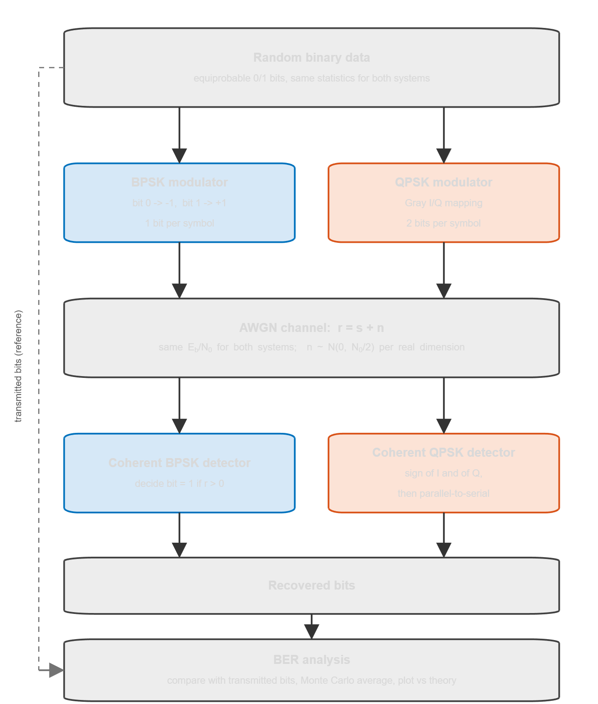
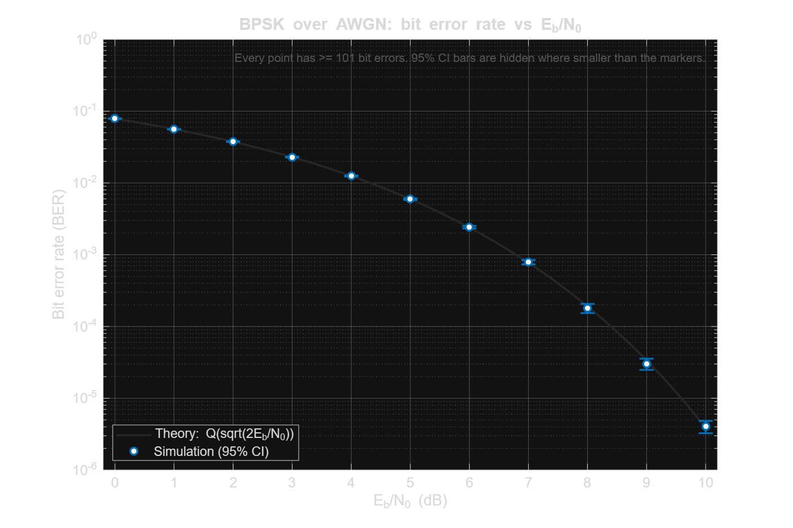
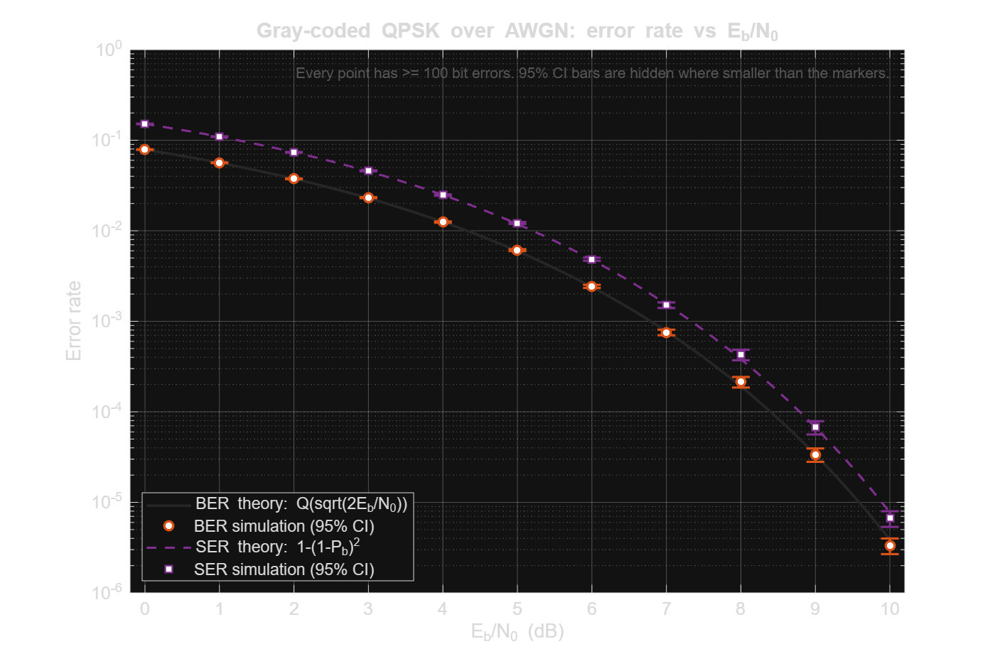
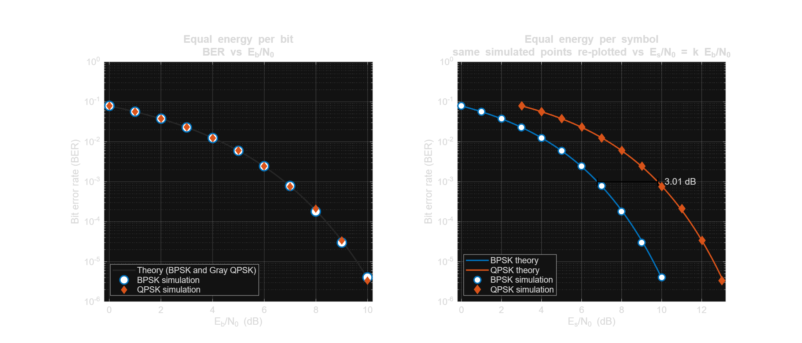
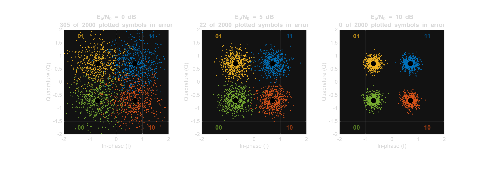

# Digital Communication System Simulation

**BPSK and QPSK over an AWGN channel: Monte Carlo BER analysis in MATLAB**

## Overview

The project simulates a complete digital link (random bits, modulation, AWGN channel, coherent demodulation, bit recovery, BER measurement) for **BPSK** and **Gray-coded QPSK**. It sweeps $E_b/N_0$ from 0 to 10 dB, estimates the bit error rate by Monte Carlo simulation, and compares it with the theoretical curves.

Everything is written in base MATLAB (no toolboxes), vectorised, seeded for reproducibility, and checked by an automated validation script.

## Objectives

1. Generate random binary data and modulate it with BPSK and with QPSK.
2. Pass both signals through an AWGN channel at the same $E_b/N_0$.
3. Demodulate coherently, recover the bits and compute the BER.
4. Use Monte Carlo averaging with enough bits for a meaningful BER estimate.
5. Compare simulated BER with the theoretical BER of coherent BPSK and Gray-coded QPSK.

## Concepts Demonstrated

- **BPSK**: antipodal signalling, 1 bit per symbol, threshold detection.
- **QPSK**: 2 bits per symbol, Gray-coded I/Q mapping, independent I/Q detection, serial/parallel conversion.
- **AWGN**: zero-mean Gaussian noise with variance $N_0/2$ per real dimension.
- **$E_b/N_0$** (and its relation to $E_s/N_0$): the correct way to compare modulation schemes.
- **BER** and symbol error rate (SER).
- **Monte Carlo simulation**: block-wise vectorised simulation, error-count stopping rule, confidence intervals.
- **Digital modulation / demodulation** with coherent detection.

## System Architecture

<p align="center">
  
</p>

Both modulation schemes are driven by random bits with identical statistics (equiprobable 0/1) and see the same $E_b/N_0$. Each scheme uses its **own independent random stream** (seed 42 for BPSK, seed 43 for QPSK), so the two Monte Carlo experiments are statistically independent. They are therefore compared under equivalent conditions, and any agreement between them is a genuine result and not a side effect of shared random numbers.

The simulation is a **baseband-equivalent, symbol-rate model**: it simulates the matched-filter output at the sampling instant, $r = s + n$, assuming perfect carrier phase and timing. See [`docs/methodology.md`](docs/methodology.md) for the justification and for all derivations.

## BPSK Methodology

1. Generate random bits.
2. Map: bit 0 → −1, bit 1 → +1 (so $E_s = E_b = 1$).
3. Add AWGN with $\sigma = \sqrt{N_0/2}$, $N_0 = E_b / (E_b/N_0)$.
4. Coherent detection: decide bit 1 if $r > 0$.
5. Count bit errors.

Theory: $P_b = Q\big(\sqrt{2E_b/N_0}\big)$.

Implementation: [`matlab/bpsk_simulation.m`](matlab/bpsk_simulation.m)

## QPSK Methodology

1. Generate random bits (serial stream).
2. **Serial-to-parallel**: `reshape(bits, 2, [])` → bit pairs $(b_0, b_1)$.
3. **Gray I/Q mapping**: $b_0$ sets the sign of I, $b_1$ the sign of Q (bit 0 → −, bit 1 → +), scaled by $1/\sqrt2$ so that $E_s = 1$ and $E_b = 0.5$.

   | bits $b_0b_1$ | 11 | 01 | 00 | 10 |
   |---|:---:|:---:|:---:|:---:|
   | symbol | $(+1+j)/\sqrt2$ | $(-1+j)/\sqrt2$ | $(-1-j)/\sqrt2$ | $(+1-j)/\sqrt2$ |
   | phase | 45° | 135° | 225° | 315° |

   Neighbouring points differ in exactly one bit (Gray property).
4. Add complex AWGN: independent $\mathcal N(0, N_0/2)$ on I and on Q.
5. **Coherent I/Q detection**: bit $\hat b_0 = [\mathrm{Re}(r) > 0]$, $\hat b_1 = [\mathrm{Im}(r) > 0]$.
6. **Parallel-to-serial**: interleave the decided pairs back into one bit stream.
7. Count bit errors and symbol errors.

Theory: $P_b = Q\big(\sqrt{2E_b/N_0}\big)$ (same as BPSK), $P_s = 1-(1-P_b)^2$.

Implementation: [`matlab/qpsk_simulation.m`](matlab/qpsk_simulation.m)

## AWGN Channel

- **Distribution:** Gaussian, zero mean, white (independent per symbol). BPSK: real noise; QPSK: independent noise on I and Q.
- **Variance:** $\sigma^2 = N_0/2$ per real dimension; total complex noise power $N_0$.
- **Normalisation:** the signal has unit symbol energy $E_s = 1$. Then $E_b = E_s/k$ with $k$ = bits per symbol, and for a given $E_b/N_0$: $N_0 = E_b / (E_b/N_0)$ and $\sigma = \sqrt{N_0/2}$.

  | Scheme | $E_b$ | $\sigma^2$ |
  |---|---|---|
  | BPSK | 1 | $1 / (2\,E_b/N_0)$ |
  | QPSK | 0.5 | $1 / (4\,E_b/N_0)$ |

- **Which quantity is used?** The independent variable is **$E_b/N_0$**, because it compares schemes at equal energy per *information bit*. $E_s/N_0 = k\,E_b/N_0$ appears only in the right panel of the comparison figure (same data, shifted axis). Plain *SNR* is not used: it depends on bandwidth and on whether the signal is treated as real or complex, which makes it easy to mix up factors of 2.

## BER Analysis

$\mathrm{BER} = (\text{number of bit errors}) / (\text{number of bits transmitted})$, estimated per $E_b/N_0$ point by Monte Carlo simulation.

- Bits are processed in vectorised blocks of `N_BITS` = $10^6$ bits.
- More blocks are added until **at least 100 bit errors** have been counted (or $10^8$ bits were simulated). This keeps the relative standard error at roughly 10 % even at low BER, where a fixed $10^6$ bits would contain only a handful of errors.
- Error bars in the single-scheme figures are 95 % confidence intervals (normal approximation).

## Simulation Parameters

Defined at the top of [`matlab/main.m`](matlab/main.m):

| Parameter | Value | Meaning |
|---|---|---|
| `cfg.ebn0_db` | `0:1:10` | $E_b/N_0$ sweep (dB) |
| `cfg.bits_per_block` | `1e6` | `N_BITS`: bits per vectorised Monte Carlo block (must be even) |
| `cfg.min_errors` | `100` | stop a point once this many bit errors are counted |
| `cfg.max_bits` | `1e8` | upper limit of bits per point |
| `cfg.seed` | `42` | random seed; BPSK uses `seed`, QPSK uses `seed + 1` (independent streams, set in `main.m`) |
| `cfg.sample_symbols` | `2000` | received symbols kept for the constellation plot and checks |

Resulting number of bits simulated per point: $10^6$ for 0 to 8 dB, $3 \cdot 10^6$ (BPSK) / $4 \cdot 10^6$ (QPSK) at 9 dB and $2.7 \cdot 10^7$ (BPSK) / $2.2 \cdot 10^7$ (QPSK) at 10 dB (exact counts in `results/ber_results.csv`).

## Results

All plots below are produced by `matlab/main.m`. Markers are simulation results, lines are theory.

### BPSK



### QPSK

The QPSK figure also shows the symbol error rate, which is about twice the BER (see below).



### BPSK vs QPSK

Left: both schemes at equal $E_b/N_0$. Right: the same simulated points re-plotted against $E_s/N_0$.



### QPSK constellation

Received symbols from the simulation itself at three $E_b/N_0$ values. Colour = transmitted symbol, black dots = ideal points, dashed lines = decision boundaries. The spread of the points grows as $E_b/N_0$ falls; points in a quadrant of the "wrong" colour are symbol errors.



### Numerical results

Generated run (`results/ber_results.csv`; seed 42 for BPSK, seed 43 for QPSK):

| Eb/N0 (dB) | Theory BER | BPSK simulated BER | QPSK simulated BER | BPSK bits / errors | QPSK bits / errors |
|---:|---:|---:|---:|---:|---:|
| 0 | 7.865e-2 | 7.838e-2 | 7.834e-2 | 1,000,000 / 78,383 | 1,000,000 / 78,337 |
| 1 | 5.628e-2 | 5.645e-2 | 5.632e-2 | 1,000,000 / 56,455 | 1,000,000 / 56,316 |
| 2 | 3.751e-2 | 3.765e-2 | 3.741e-2 | 1,000,000 / 37,652 | 1,000,000 / 37,412 |
| 3 | 2.288e-2 | 2.296e-2 | 2.282e-2 | 1,000,000 / 22,965 | 1,000,000 / 22,823 |
| 4 | 1.250e-2 | 1.249e-2 | 1.272e-2 | 1,000,000 / 12,491 | 1,000,000 / 12,720 |
| 5 | 5.954e-3 | 6.065e-3 | 5.891e-3 | 1,000,000 / 6,065 | 1,000,000 / 5,891 |
| 6 | 2.388e-3 | 2.348e-3 | 2.428e-3 | 1,000,000 / 2,348 | 1,000,000 / 2,428 |
| 7 | 7.727e-4 | 8.080e-4 | 7.720e-4 | 1,000,000 / 808 | 1,000,000 / 772 |
| 8 | 1.909e-4 | 1.770e-4 | 1.930e-4 | 1,000,000 / 177 | 1,000,000 / 193 |
| 9 | 3.363e-5 | 3.400e-5 | 3.450e-5 | 3,000,000 / 102 | 4,000,000 / 138 |
| 10 | 3.872e-6 | 3.889e-6 | 4.545e-6 | 27,000,000 / 105 | 22,000,000 / 100 |

These numbers come from one pair of random seeds. Different seeds (or MATLAB instead of Octave, see below) give slightly different values within the statistical uncertainty.

## Theoretical vs Simulated Performance

**What theory predicts.** For coherent detection in AWGN, BPSK has $P_b = Q(\sqrt{2E_b/N_0})$. Gray-coded QPSK, being two independent BPSK streams on the orthogonal I and Q axes, has the **same BER at the same $E_b/N_0$**, and a symbol error rate $P_s = 1-(1-P_b)^2 \approx 2P_b$.

**What the simulation shows** (observations from the run above, checked by `validate_simulation.m`):

- BPSK BER, QPSK BER and QPSK SER decrease monotonically as $E_b/N_0$ increases.
- At all 11 points the simulated BER agrees with theory within the Monte Carlo uncertainty. In units of the standard error the largest deviations are $|z|=1.44$ (BPSK BER), $1.97$ (QPSK BER) and $2.05$ (QPSK SER); the acceptance limit of the check is 4.
- The simulated BPSK and QPSK BER curves coincide at equal $E_b/N_0$ within statistical uncertainty (largest $|z|$ of their difference: 1.60). This test is valid because the two simulations use independent random streams, which the validation script verifies on the simulated noise samples (largest $|\rho|$ between BPSK and QPSK noise: 0.006).
- The measured QPSK SER/BER ratio rises from 1.92 at 0 dB to 2.00 at 8–10 dB, consistent with the Gray-coding argument: at high SNR nearly every symbol error flips exactly one bit.
- Measured noise standard deviation matches $\sqrt{N_0/2}$ to within 2.6 % (BPSK) and 2.4 % (QPSK) at all points.

**What is theory and what is observation.** The 3.01 dB offset between the two curves in the right panel of the comparison figure is a *theoretical* consequence of $E_s = 2E_b$ for QPSK ($10\log_{10}2 = 3.01$ dB), applied to the x-axis of the simulated points. It is not a measured BER difference, because at equal $E_b/N_0$ the measured BERs are equal. The bandwidth advantage of QPSK (two bits per symbol) is also theory only; this symbol-rate model has no bandwidth or pulse shaping.

**Limitations.** Uncoded transmission, AWGN only, perfect synchronisation. Points near $10^{-6}$ have only about 100 errors, so their uncertainty is about ±20 % (95 % CI).

## How to Run

Only base MATLAB is required (no toolboxes).

**MATLAB**

```matlab
% from the repository root
run('matlab/main.m')
% or:  cd matlab; main
```

**GNU Octave**

```bash
octave --no-gui matlab/main.m
```

On a headless Linux machine use a virtual display so that figures can be rendered and saved:

```bash
xvfb-run -a octave --no-gui matlab/main.m
```

`main.m` runs the simulations (about 10 seconds), writes all figures into `results/` and `figures/`, writes `results/ber_results.csv`, prints a summary table and runs the validation checks (every line should read `[PASS]`).

**Tested with:** GNU Octave 8.4.0 on Ubuntu 24.04 (Qt graphics toolkit under Xvfb; packages installed in the test environment: `octave`, `gnuplot-nox`, `ghostscript`, `fonts-freefont-otf`, `xvfb`). The code uses only base MATLAB functions and syntax that is valid in both environments, but it **has not yet been run in MATLAB**. Exact random numbers differ between MATLAB and Octave (different random number initialisation and normal generators), so the BER values will differ slightly while agreeing with theory statistically. Within one environment, results are exactly reproducible for a fixed seed.

## Project Structure

```
digital-communication-simulation/
├── README.md
├── .gitignore
├── matlab/
│   ├── main.m                 # parameters, orchestration, CSV output, calls everything else
│   ├── bpsk_simulation.m      # Monte Carlo BPSK over AWGN
│   ├── qpsk_simulation.m      # Monte Carlo Gray-coded QPSK over AWGN
│   ├── theoretical_ber.m      # theoretical BER / SER (base MATLAB, erfc-based Q-function)
│   ├── ber_comparison.m       # BPSK, QPSK and comparison BER figures
│   ├── plot_constellation.m   # QPSK constellation figure from simulated symbols
│   ├── draw_block_diagram.m   # system block diagram figure
│   └── validate_simulation.m  # automated sanity and statistical checks
├── results/                   # generated by main.m
│   ├── bpsk_ber_vs_ebn0.png
│   ├── qpsk_ber_vs_ebn0.png
│   ├── ber_comparison.png
│   ├── constellation_diagram.png
│   └── ber_results.csv        # bits, errors, simulated and theoretical BER per point
├── figures/
│   └── system_block_diagram.png
└── docs/
    └── methodology.md         # model, derivations, statistics, validation, limitations
```

## Key Learnings

- **Normalisation matters.** Converting $E_b/N_0$ to the noise variance correctly (including $E_b = E_s/k$ and $\sigma^2 = N_0/2$ per real dimension) is what makes a BPSK-vs-QPSK comparison fair. QPSK needs $\sigma^2 = 1/(4E_b/N_0)$ for unit symbol energy, while BPSK needs $1/(2E_b/N_0)$.
- **QPSK = two orthogonal BPSK streams.** At equal $E_b/N_0$ the BER is identical; the difference between the two schemes is spectral efficiency, not BER (and the apparent 3 dB gap only appears when plotting against $E_s/N_0$).
- **Gray coding** keeps neighbouring constellation points one bit apart, so the most likely symbol error flips exactly one bit and BER ≈ SER / 2 at high SNR. A mapping without this property would turn some of those likely symbol errors into two-bit errors.
- **Monte Carlo needs a stopping criterion tied to the number of errors**, not just a fixed number of bits, to get comparable accuracy over several decades of BER.
- **Validate statistically.** Comparing simulation with theory in units of the standard error ($z$-scores) distinguishes a correct simulation from a wrong one far more reliably than judging whether curves "look similar" on a log plot.
- **Independent random streams.** Seeding two simulations identically makes them share the same random numbers, which correlates their results and flatters any comparison between them. Each scheme therefore has its own seed, and the validation script checks the noise samples for independence.

## Future Improvements

Not implemented. Possible extensions:

- higher-order PSK/QAM (8-PSK, 16-QAM, 64-QAM) and their Gray mappings,
- Rayleigh and Rician fading channels,
- channel coding (e.g. convolutional or LDPC codes) and coding gain,
- OFDM,
- adaptive modulation,
- comparison with FSK,
- waveform-level (passband) simulation with pulse shaping, matched filtering and carrier/timing recovery.
